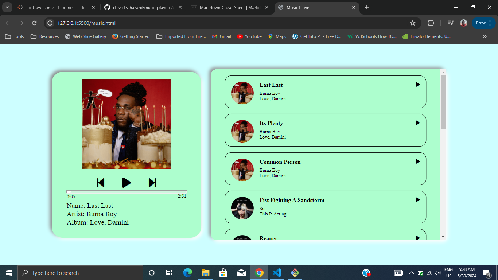
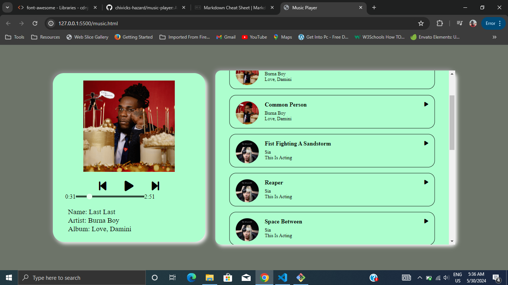
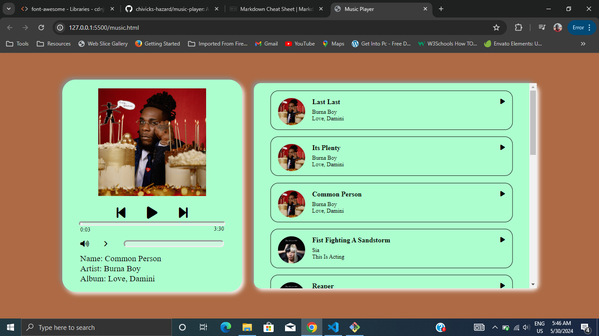

# My Music Player

This is a Web-based music player which uses vanilla CSS and JavaScript with Font Awesome for icons

## The First Version

## The Second Version (First Design Overhaul)

## The Third Version (Second Design Overhaul)
The major change was the addition of a playlist

## The Fourth Version
Visually, nothing changes but under the hood, there was a shift to Object Oriented Programming in order to make the app code easier to read and maintain.

## The Fifth Version
A seek slider was added to the app but it affected the UI of the main module. A background color changer was also added for aesthetics.

## The Sixth Version
The slider was reverted to its previous state but with the addition of a volume slider was not successful, the UI was still distorted. The colors for the background are more saturated.
